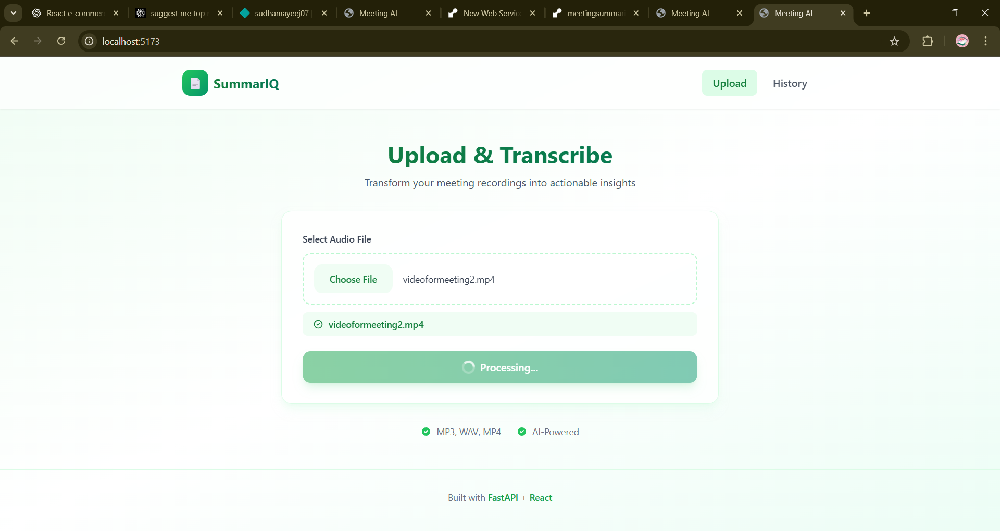
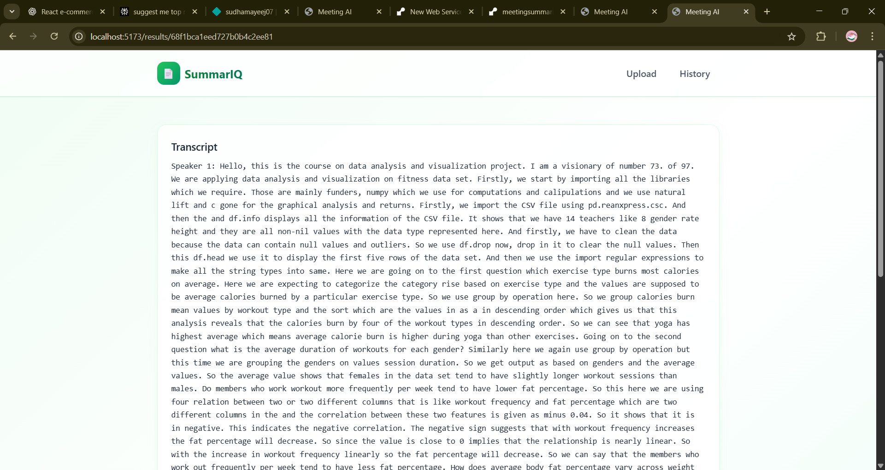
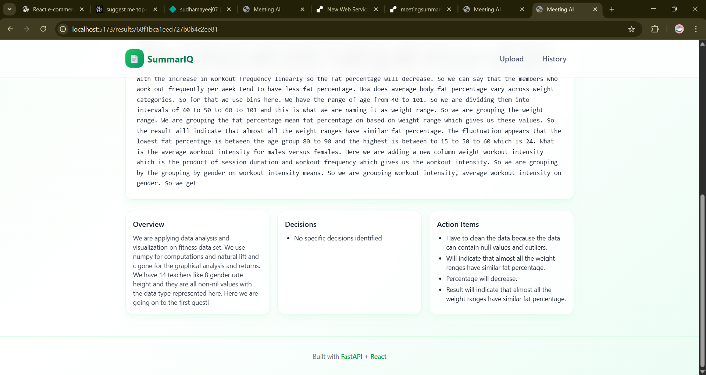

# AI-Powered Meeting Transcription & Summarization Tool

A comprehensive full-stack application that transforms your meeting recordings into structured, searchable, and actionable content. Upload any meeting audio file and get instant, accurate transcripts with speaker identification and AI-generated summaries.

## 🚀 Key Features

- **Automated Transcription**: Convert speech to text with high accuracy using OpenAI's Whisper
- **Speaker Diarization**: Automatically identify and tag different speakers in the conversation
- **AI-Powered Summaries**: Get concise overviews, key decisions, and action items extracted by AI
- **User-Friendly Interface**: Clean, responsive design built with React and TailwindCSS
- **Secure & Scalable**: Built with FastAPI and MongoDB Atlas for reliable performance

## 🛠️ Tech Stack

### Frontend
- **Framework**: React 18 with Vite
- **Styling**: TailwindCSS + HeadlessUI
- **State Management**: React Context API
- **HTTP Client**: Axios

### Backend
- **Framework**: FastAPI (Python 3.9+)
- **Database**: MongoDB Atlas (with Motor async driver)
- **Authentication**: JWT (JSON Web Tokens)
- **API Documentation**: Swagger UI & ReDoc

### AI/ML Components
- **Speech-to-Text**: OpenAI's Whisper
- **Speaker Diarization**: Pyannote.audio
- **Text Summarization**: HuggingFace Transformers
- **NLP Processing**: spaCy

## 📸 Screenshots

### 1. Upload Interface

*Easily upload your meeting recordings in various formats*

### 2. Transcription View

*View and edit transcriptions with speaker identification*

### 3. Summary Dashboard

*Get AI-generated summaries and action items*

## 🚀 Quick Start

Follow these steps to get the application up and running on your local machine.

### Prerequisites

- Node.js 16+ and npm/yarn
- Python 3.9+
- MongoDB Atlas account (or local MongoDB instance)
- FFmpeg (for audio processing)

### Backend Setup

1. **Navigate to the backend directory and set up a virtual environment:**
   ```bash
   cd backend
   python -m venv venv
   source venv/bin/activate  # On Windows: .\venv\Scripts\activate
   ```

2. **Install Python dependencies:**
   ```bash
   pip install -r requirements.txt
   ```

3. **Set up environment variables:**
   - Copy `backend/.env.example` to `backend/.env` and fill values
   - (Optional) Keep `USE_STUB=1` to run without heavy AI models

3. **Create virtual environment and install dependencies:**
   ```bash
   # Create virtual environment
   python -m venv .venv
   
   # Activate virtual environment (Windows)
   .venv\Scripts\activate
   
   # Install dependencies
   pip install -r requirements.txt
   ```

4. **Run the backend server:**
   ```bash
   # From the backend directory
   uvicorn app.main:app --reload --host 0.0.0.0 --port 8000
   ```
   
   Or from the project root:
   ```bash
   uvicorn app.main:app --reload --host 0.0.0.0 --port 8000 --app-dir backend
   ```

5. **Verify the server is running:**
   - Open http://localhost:8000/docs in your browser
   - You should see the FastAPI interactive documentation

Frontend
1. From `frontend/`:
   - `npm install`
   - `npm run dev`
2. Set `VITE_API_BASE` in `frontend/.env` (default: http://localhost:8000)

Deployment
- Frontend: Netlify/Vercel
- Backend: Render/Railway
- DB: MongoDB Atlas

Environment Variables
- Backend: see `backend/.env.example`
- Frontend: see `frontend/.env.example`

Notes
- Stub mode returns deterministic fake outputs suitable for development.
- Replace stub by setting `USE_STUB=0` and installing optional heavy packages (see comments in `backend/requirements.txt`).

## Troubleshooting

### Getting Static/Stub Data After Upload

If you're still getting static data after uploading a video, check the following:

1. **Check USE_STUB setting in backend/.env**
   ```bash
   # In backend/.env, set:
   USE_STUB=0
   ```

2. **Install AI dependencies** (required when USE_STUB=0)
   ```bash
   # Activate your virtual environment first
   .venv\Scripts\activate  # Windows
   
   # Install the heavy AI dependencies
   pip install torch openai-whisper transformers sentencepiece
   ```

3. **Restart the backend server**
   ```bash
   # Stop the current server (Ctrl+C) and restart:
   uvicorn app.main:app --reload --host 0.0.0.0 --port 8000 --app-dir backend
   ```

4. **Check the logs** - The server will now show detailed logs:
   - "USE_STUB mode: False" on startup
   - "Loading Whisper model..." during processing
   - "Transcription completed: X characters"

### If You Want to Keep Using Stub Mode

If you prefer to use stub mode for testing (no AI dependencies needed):
1. Set `USE_STUB=1` in `backend/.env`
2. The system will return consistent test data for all uploads

### Performance Notes

- First upload with real AI will be slow (downloading models ~1-2GB)
- Subsequent uploads will be faster (models cached)
- Processing time depends on audio length (~1-2 min per 10 min of audio)
